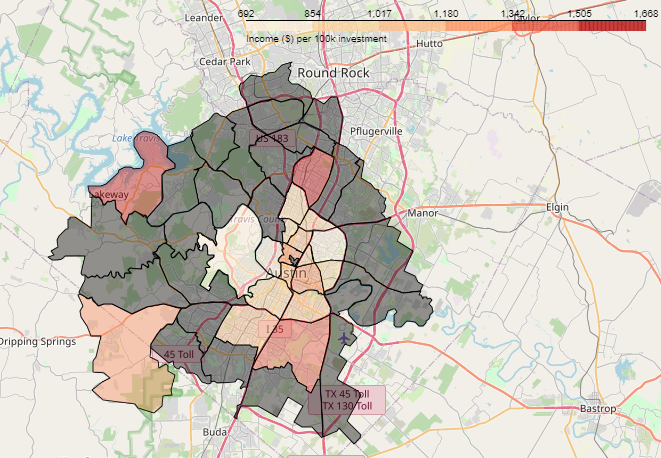

# Problem statement
In this work, we are analyzing the airbnb market data for the city of Austin, with a focus on 2023 data. The primary objectives of this study are two folds:
- To provide an insight towards the airbnb market and latest trends, with an emphasis on identifying best investment opportunities in different areas.
- To deliver a modeling tool (with a user interface) to help the user estimate the average yearly income for their property of interest.

Different estimators including linear regression (with interaction terms and regularization), XGBoost, and Neural Network are used to model airbnb yearly income with the best model giving a R2 score of 0.71 and a mean absolute error of $72 on our test data. The primary stake holders for this project are investors who are looking for some airbnb market insights (for their current or future homes) with properties in the mid range price (outstanding properties like mansions or very specific cases). Because of this, we tailored our model to best align with this group of stakeholders. As a result of this work, we have provided some suggestions for what regions in Austin present the highest potential for airbnb rentals, both for the current home owners and also for the ones who are looking for new investment opportunities. Additionally, this work provides some data-driven suggestions for what factors have the most effect on airbnb income and what actions hosts could take to boost their airbnb income without having to spend too much extra.  

# Data collection and sources

The primary data in this study has been scraped from airbnb by a third party website ([insideairbnb](www.insideairbnb.com)). The airbnb data used in this study was scaped on a quarterly basis, during the entire year of 2023. Our data included, but was not limited to, information about the listing (number of beds/baths), geo location of the property, host's information, reviews about the property, the duration for which the property has been on airbnb, amenities included with the property, listing price, and the calendar for property availability. Although quite comprehensive, our data is missing some important information (like number of bedrooms, amenities info, etc.) for some of those quarterly scrapes (this could be some technical difficulties related to the website collecting the information or some changes in airbnb's API's over time). We have employed different feature engineering techniques to look for missing information based on the data we had available. During the project, we have decided to use home price approximations for a better modeling of our data and home price approximations from [Zillow](www.zillow.com\data) were used for that purpose. Estimating the occupancy rate is an important part of modeling the income from rental properties and since this information is not directly accessible from airbnb.com, we have used the approach proposed in this [report](https://sfbos.org/sites/default/files/FileCenter/Documents/52601-BLA.ShortTermRentals.051315.pdf). 

# Methodology and modeling
After processing the raw data, a comprehensive exploratory data analysis was performed to understand the data, identify the important features, and observe the quality and distribution of the features and target variables. Different information and recommendations were offered based on the results of our EDA, e.g. the following map shows the zipcodes with the best airbnb investment opportunities in Austin (yearly income per 100k of investment for people who want to buy new properties for investment purposes-darker areas have too few points for a reliable estimate).

Data were then cleaned based on the primary objective of the work and the target audiences (certain assumptions were made here about reasonable listing prices (< $2000/night), occupancy rates(<= 0.7), and the number of bedrooms in our listings(<= 7)). Three different families of estimators were used in this work (linear regression, XGBoost, and Neural Network) with XGBoost giving us the best regression results. Models were hyperparameter tuned using `BayesSearchCV`. Our best predictor (XGBoost) showed a R2 score of 0.71.

# Streamlit app and the user interface

In order for the user to get the most out of this project, we created a simple user interface for the stakeholders to input their home info and get estimates of their yearly income, in addition to some recommendations and insights towards the airbnb market in Austin. The app is available locally by running `streamlit run airbnb_investment_austin.py` commend from the `./gui` folder, after they download the repo into their local machine and locally install `streamlit`, `geopandas`, `folium`, and `pandas` python libraries.

# Conclusions and future work
In this work, we have presented a data-driven approach to investigate airbnb market in Austin to help the investors get a better insight towards the short term home rental market and identify possible investment opportunities. Here are some of the key findings:
- Our estimate shows an average occupancy rate of 0.25 in Austin, which is in line with what 3rd party airbnb market analysis websites are presenting.
- The average quarterly income from airbnb in the city of Austin is $4600.
- First quarter of the year usualy generates more income than other times.
- Houses with 4+ bedrooms show a jump in the income, compared to smaller properties. 
- Being an experienced host (a.k.a. superhost) significantly impacts the yearly income of listings. 
- XGBoost performed the best in predicting airbnb prices with an R2 score of 0.71 on the test data. 

**Future work:**
- Occupancy rate plays an important role in estimating airbnb incomes and since this data is not publicly available, finding a reliable way to estimate the occupancy rate is very important. 
- Our estimators struggled the most in modeling high and low occupancy rates. Fine tunning the current estimator or finding an alternative will improve our model prediction capabilities. 
